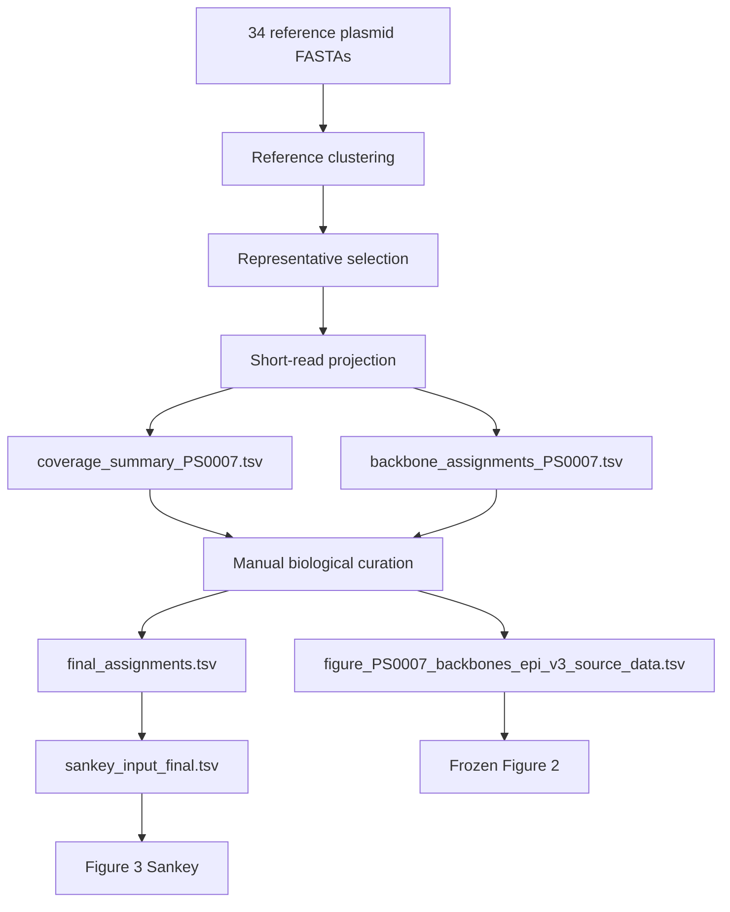

# Script DAG

| Script | Status | Inputs | Outputs | Used later by |
| --- | --- | --- | --- | --- |
| `scripts/01_reference_plasmid_workflow/cluster_reference_plasmids.sh` | Used, optional validation | `data/plasmid_references/references_34/*.fasta` | `validation/reference_plasmid_workflow/blast_all_vs_all.tsv` and supporting validation files | Reference workflow validation only |
| `scripts/02_backbone_assignment/validate_sankey_input.py` | Used | `figures/figure3_sankey/sankey_input_final.tsv` | `validation/figure3_sankey_validation.md`, `validation/figure3_sankey_counts.tsv` | Public validation |
| `scripts/03_tables/build_input_inventory.py` | Used | `data/**/*`, `data/accession_lists/reference_plasmids_34.tsv` | `validation/input_inventory.tsv`, `validation/reference_plasmid_validation.md` | Public validation |
| `scripts/03_tables/validate_public_release.py` | Used | Retained data, provenance, figure, and script files | `validation/release_validation.md`, `validation/release_hashes.tsv` | Public validation |
| `scripts/04_figures/make_figure3_sankey.mjs` | Used | `figures/figure3_sankey/sankey_input_final.tsv` | `validation/figure3_sankey_regenerated_svg/RECAPTARII_Figure3_sankey_final.svg` and validation tables | Figure 3 content validation |

## Workflow Graph

## Excluded Script Classes

The public repository excludes obsolete, experimental, preview, backup, and local-infrastructure scripts. The retained scripts are the canonical public scripts required to validate the release and regenerate the Figure 3 SVG from the final input table.

